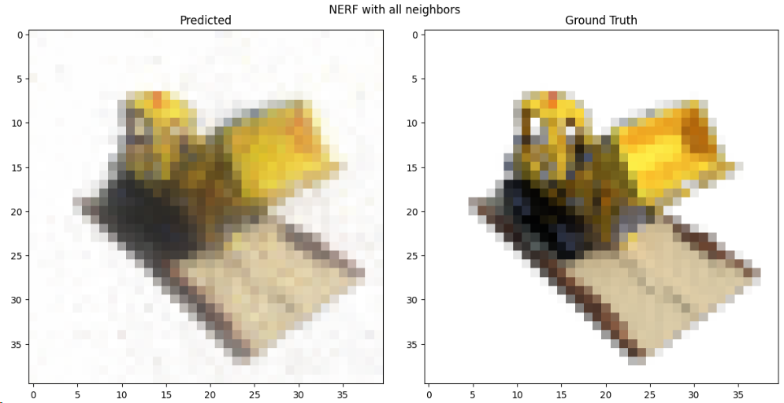
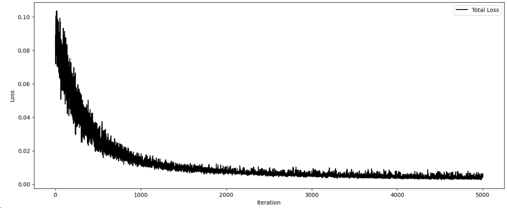
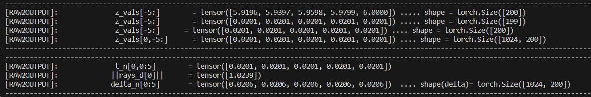
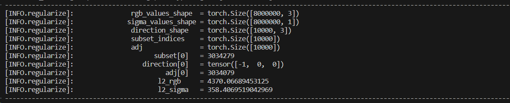

# NERF

[View Mesh][REAMDE.html]

Method for synthesizing novel views of complex scenes by optimizing an underlying continuous volumetric scene function using a sparse set of input
views. Algorithm represents a scene using a fully-connected (nonconvolutional) deep network, whose input is a single continuous 5D coordinate (spatial location $(x, y, z)$ and viewing direction $(\theta, \phi)$) and whose
output is the volume density and view-dependent emitted radiance at
that spatial location.  

## Objective Function
We try to train a nerf with an objective task of minimizing the **MSE**. Furthermore, we add regularization for smoothing the neighboring colors $c_n$ and to enforce smoothness and consistency in the predicted density $\sigma$. The loss is given by the following formula.  

$$
\begin{align*}
    L_{NERF} = \|\|y - \hat{y} \|\|^2 + \lambda_{rgb}\cdot L_{color} + \lambda_{\sigma}\cdot L_{\sigma} 
\end{align*}
$$  

In the figure below, we observe the loss over 5000 iterations when it reaches a plateau. 

## 1. Find Nearest Neighbor
We compute the $\textbf{Nearest Neighbor}$ using the following formula for a ray $R \in \mathbb{R}^{rays}$.  

$$
\begin{align*}
    Cloud_O &= (-3.75,-3.75,-3.75) \\
    d(R_{ij}, Cloud_O) &= \lfloor R_{ij} - Cloud_O \rceil_3 \\ 
    index_{ijk} &= \frac{d(R_{ij}, Cloud_O)}{STEP} \\
    index &= index_i \cdot 200 + index_j \cdot 200 \cdot 200 + index_k 
\end{align*}
$$  

In the code below, we observe the values of the closest $\textit{cloud point}$ for ray $R_1$ at first sample.  

## 2. Raw to output 
It's the rendering function that outputs the color for a predicted density $\sigma_i$ as well as RGB values $c_i$. For context, $z_n$ is the sampling and $\overrightarrow{ray_i}$ is the direction of the ray.  

$$
\begin{align*}
    z_{vals} &\in \mathbb{R}^1 \quad \text{and} \quad |z_{vals}| = 200\\
    ray &\in \mathbb{R}^3 \quad \text{and} \quad |ray| = 1024 \\ 
    t_i &= z_n * \|\|\overrightarrow{ray_i}\|\| \\
    \delta_i &= t_{i+1} - t_i \quad \text{and} \quad \delta_n = t_n 
\end{align*}
$$

In the code below, we can observe how the step function $t_n$ is created and then multiplied with the ray's direction as a magnitude.

## 3. Regularization 

We compute the regularization of the color and the depth sigma by substracting a neighbor. The neighbor chosen si the immediate $k+1$ next element from the **point cloud indices**.   

$$
\begin{align*}
    L_{reg colour} &= \sum_{i,j,k}{|c[i,j,k]-c[i,j,k+1]|^2} \\    
    L_{reg \sigma} &= \sum_{i,j,k}{|\sigma[i,j,k]-\sigma[i,j,k+1]|^2}
\end{align*}
$$

