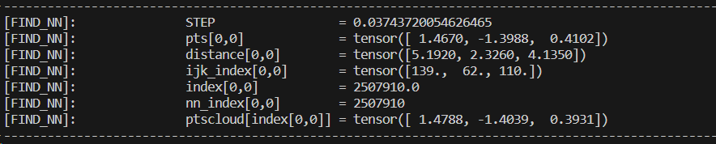

## 1. Find Nearest Neighbor
We compute the $\textbf{Nearest Neighbor}$ using the following formula for a ray $R \in \mathbb{R}^{rays}$.  

$$
\begin{align*}
    Cloud_O &= (-3.75,-3.75,-3.75) \\
    d(R_{ij}, Cloud_O) &= \lfloor R_{ij} - Cloud_O \rceil_3 \\ 
    index_{ijk} &= \frac{d(R_{ij}, Cloud_O)}{STEP} \\
    index &= index_i \cdot 200 + index_j \cdot 200 \cdot 200 + index_k 
\end{align*}
$$  

In the code below, we observe the values of the closest $\textit{cloud point}$ for ray $R_1$ at first sample.  

## 2. Raw to output 
It's the rendering function that outputs the color for a predicted density $\sigma_i$ as well as RGB values $c_i$.    

$$
\begin{align*}
    t_i &= z_n * \|\overrightarrow{ray_i}\| \\
    \delta_n &= t_{n+1} - t_n \text{and} \delta_n = t_n
\end{align*}
$$